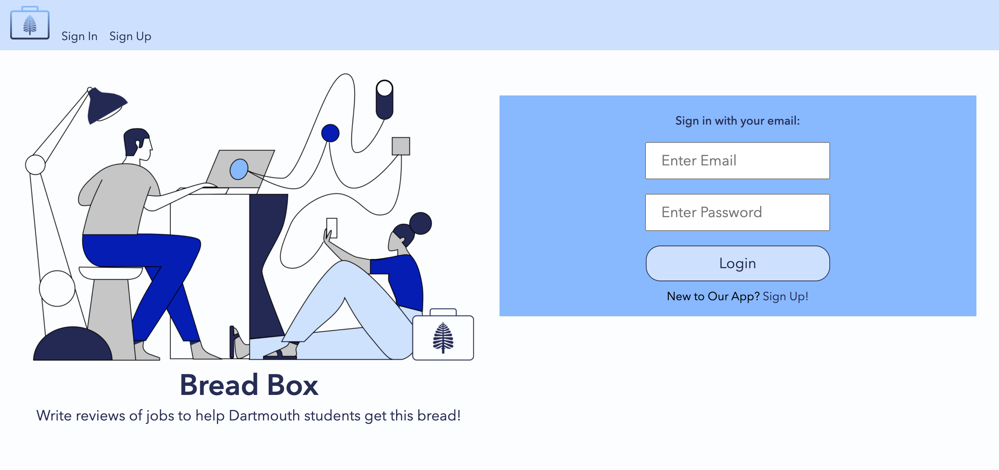
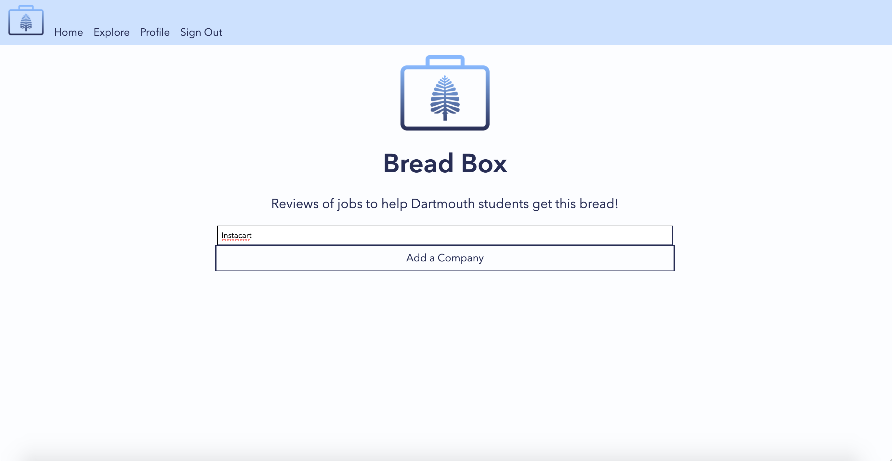
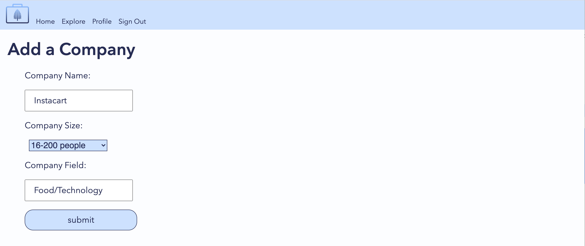
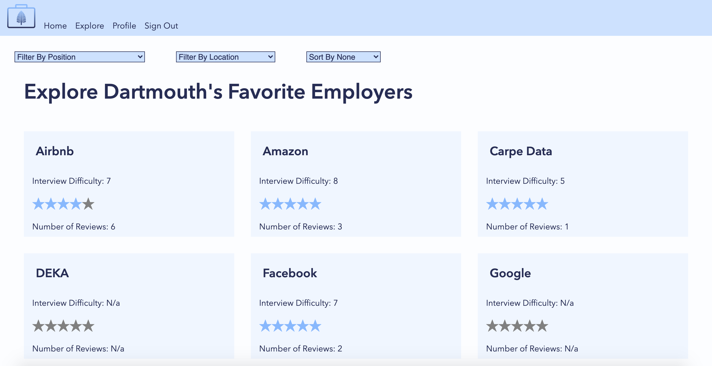
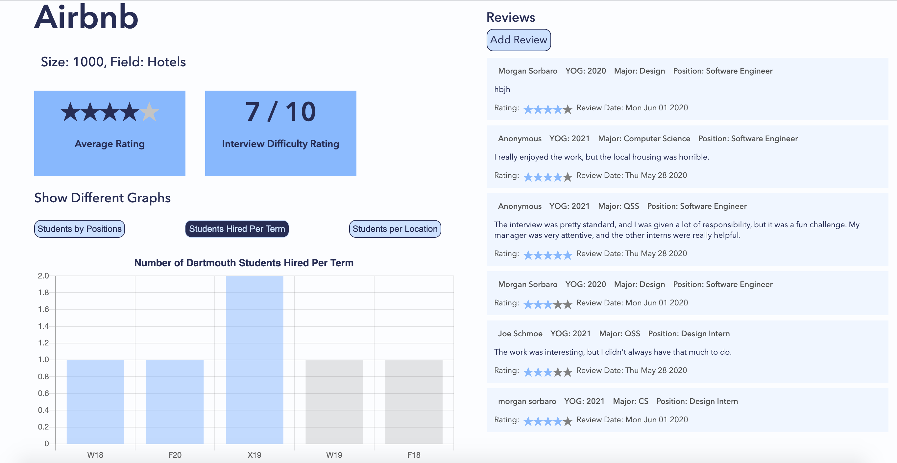
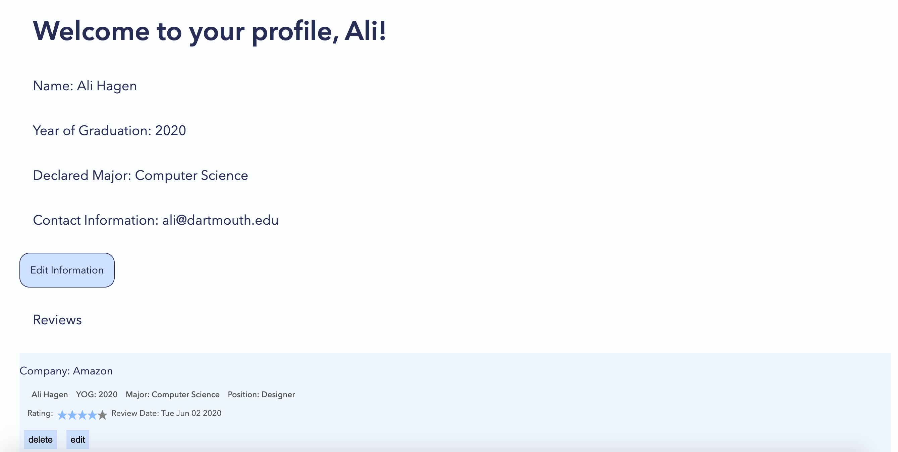

# databaseMAVS
## Bread Box: Reviews of jobs to help Dartmouth students get this bread!

# Here is how to run our front end:
* First, make sure that your backend is running (see backend readme) and that you are connected to the Dartmouth VPN
* After pulling, run "yarn" to load all the dependencies 
* Then type "yarn start" to actually run the code 
* Go to localHost://8080 to see the front end in action

### Sign up or log in with your Dartmouth email

### Home Page
From the home page, users can search for companies and go their page from the search results, or Add a Company if it is not already on the site.

### Add a Company

### Explore
Users can explore the different employers that students have already reviewed. They can also use the filters on the top to sort the companies.

### Company page
Each company has its own page (linked from the explore page or search) to feature the data collected from reviews. There are statistics, different graphs you can select at a time, and all the submitted reviews. The user can click Add a Review to fill out a form to review the company.

### Profile page
The user can view or edit their profile information and personal reviews in the Profile tab

